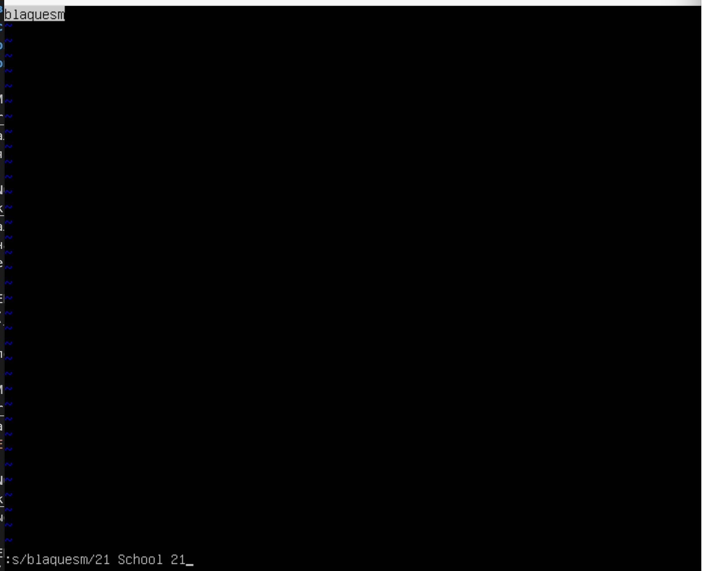
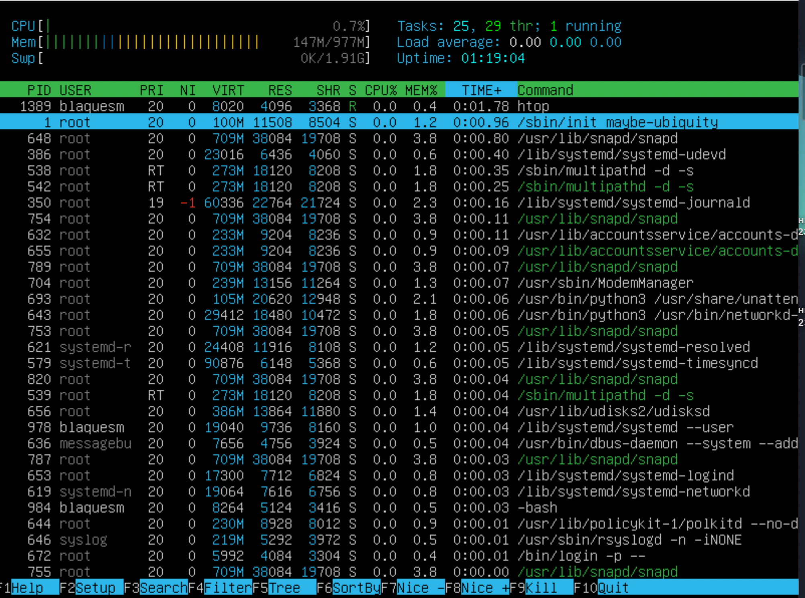

## Part 1. Установка ОС
***
* Вывод версии Ubuntu с помощью команды cat /etc/issue


## Part 2. Создание пользователя
***
* Команда для создания нового пользователя.


* Вывод команды cat /etc/passwd


## Part 3. Настройка сети ОС
***
1. __Задание названия машины вида user-1, команда:__ ``` sudo hostnamectl set-hostname user-1 ``` 
2. __Установка временной зоны, соответствующей моему текущему местоположению, команда:__ ```
sudo timedatectl set-timezone Europe/Samara ```

* Результат установки временной зоны


3. __Вывести названия сетевых интерфейсов с помощью консольной команды.__

* Вывод названий сетевых интерфейсов, команда: ```ip link show```

* Io - это аппаратный или программный метод, который направляет полученный сигнал или данные обратно отправителю. Он используется как дополнительное средство в исправлении проблем физического соединения.

4. __Используя консольную команду получить ip адрес устройства, на котором вы работаете, от DHCP сервера. Дать расшифровку DHCP.__

* Получение ip адреса устройства, на котором работаю, команда: ```hostname -I```


* DCHP (Dynamic Host Configuration Protocol) — протокол динамической настройки узла) — прикладной протокол, позволяющий сетевым устройствам автоматически получать IP-адрес и другие параметры, необходимые для работы в сети TCP/IP. Данный протокол работает по модели «клиент-сервер». Для автоматической конфигурации компьютер-клиент на этапе конфигурации сетевого устройства обращается к так называемому серверу DHCP и получает от него нужные параметры. Сетевой администратор может задать диапазон адресов, распределяемых сервером среди компьютеров. Это позволяет избежать ручной настройки компьютеров сети и уменьшает количество ошибок. Протокол DHCP используется в большинстве сетей TCP/IP.

5. __Определить и вывести на экран внешний ip-адрес шлюза (ip) и внутренний IP-адрес шлюза, он же ip-адрес по умолчанию (gw).__
* Получение внешнего ip адреса шлюза, команда: ```curl icanhazip.com``` или ```curl ifconfig.me```

* Получение внутреннего ip адреса шлюза, команда: ```ip route```

* Результаты вывода команд


6. __Задать статичные (заданные вручную, а не полученные от DHCP сервера) настройки ip, gw, dns (использовать публичный DNS серверы, например 1.1.1.1 или 8.8.8.8).__

* Ввёл команду ```sudo vim /etc/netplan/00-installer-config.yaml``` и внёс изменения.


* Применил изменения командой ```sudo netplan apply```

7. __Перезагрузить виртуальную машину. Убедиться, что статичные сетевые настройки (ip, gw, dns) соответствуют заданным в предыдущем пункте.__
* Перезагрузил машину командой ```sudo reboot``` и проверил ip машины командой ```ip route```


* Успешно пропинговал командой ```ping 1.1.1.1``` и ```ping ya.ru```.


## Part 4. Обновление ОС
***
__Обновить системные пакеты до последней на момент выполнения задания версии.__

* Обновление индекса пакетов системы, команда: sudo apt-get update

* Обновление всех устаревших пакетов до последних версий, команда: sudo apt-get upgrade

* Cообщение об отсутствующих обновлениях


## Part 5. Использование команды sudo
***
__Разрешить пользователю, созданному в Part 2, выполнять команду sudo.__

* Добавил пользователя guest в группу sudo, команда: sudo usermod -aG sudo guest

* Команда sudo предоставляет возможность пользователям выполнять команды от имени суперпользователя root, либо других пользователей. Правила, используемые sudo для принятия решения о предоставлении доступа, находятся в файле /etc/sudoers (для редактирования файла можно использовать специальный редактор visudo, запускаемый из командной строки без параметров, в том числе без указания пути к файлу); язык их написания и примеры использования подробно изложены в man sudoers).Имя команды означает substitute user do или super user do. Утилита позволяет запускать программы от имени другого пользователя, но чаще всего от имени корневого. Утилита была разработана еще в 1980 году Бобом Когшелом и Клиффом Спенсером. За это время сменилось много разработчиков и было добавлено много функций.

* Имя машины изменено


## Part 6. Установка и настройка службы времени
***
Настроить службу автоматической синхронизации времени.

* Установил утилиту ntp командой ```sudo apt install -y ntp```
* Проверил, что подключен к серверам синхронизации времени командой ```ntpq -p```
* Командой ntp остановил ```sudo systemctl stop ntp```
* Принудительно синхронизировал время командой ```sudo ntpd -gq```
* Запустил ntp командой ```sudo systemctl start ntp```
* Проверил запуск службы командой ```sudo systemctl status ntp```
* Проверил синхронизацию командой ```timedatectl```
* Служба ntp отображается как отсутствующая, но синхронизация была активна.
* Решение : удаляем ntp командой ```sudo apt-get purge ntp``` 
* Вывод команды ```timedatectl show ```содержит ```NTPSynchronized=yes```


## Part 7. Установка и использование текстовых редакторов
***
* Установка MCEDIT ``` sudo apt-get install mcedit```
1. __Используя каждый из трех выбранных редакторов, создайте файл test_X.txt, где X -- название редактора, в котором создан файл. Напишите в нём свой никнейм, закройте файл с сохранением изменений.__
* test_VIM.txt 


Для выхода с сохранением изменений ```:wq``` затем ```Enter```

* test_NANO.txt


Для выхода с сохранением изменений ```Ctrl``` + ```X``` затем ```Y``` и ```Enter```
* test_MCEDIT.txt


Для выхода с сохранением изменений ```Esc``` далее ```Да``` и ```ENTER```

2. __Используя каждый из трех выбранных редакторов, откройте файл на редактирование, отредактируйте файл, заменив никнейм на строку "21 School 21", закройте файл без сохранения изменений.__

* test_VIM.txt


Для выхода без сохранения изменений ```:q!``` затем ```Enter```

* test_NANO.txt


Необходимые команды ```Ctrl``` + ```X``` и ```N```

* test_MCEDIT.txt 


Команды ```Esc``` выбор ```Нет``` и ```Enter```

3. __Используя каждый из трех выбранных редакторов, отредактируйте файл ещё раз (по аналогии с предыдущим пунктом), а затем освойте функции поиска по содержимому файла (слово) и замены слова на любое другое.__

* test_VIM.txt поиск


Использовал ```/``` ввёл имя. Совпадение выделяется.

* test_NANO.txt поиск


Использовал ```Ctrl``` + ```W```, ввёл искомую строку и нажал ```Enter```. Появилась информация о количестве совпадений.

* test_MCEDIT.txt поиск


Нажал F7, ввёл искомую строку и выбрал ```Искать все``` в поиска.

* test_VIM.txt замена



Используемая каоманда ```:s/chaurodr/21 School 21```

* test_NANO.txt замена


```Ctrl``` + ```\```  ввёл строку


 Ввёл замену и нажал ```Enter```


```Y``` для подтверждения

* test_MCEDIT.txt замена


Нажал ```F4``` ввёл замену и выбрал "Дальше".


В появившемся окне выбрал "Заменить".

## Part 8. Установка и базовая настройка сервиса SSHD
***
1. __Установить службу SSHd.__
Установить SSH-сервер в системе, команда: ```sudo apt-get install openssh-server```

2. __Добавить автостарт службы при загрузке системы.__
Для включения автостарта службы воспользуемся командой: ```sudo systemctl enable ssh```

3. __Перенастроить службу SSHd на порт 2022.__

* Для этого открыл файл конфигурации с помощью команды: ```sudo vim /etc/ssh/sshd_config```
* Нашёл строку, определяющую порт: Port 22
* Поменял его на 2022 и раскомментировал строку.


4. __Используя команду ps, показать наличие процесса sshd. Для этого к команде нужно подобрать ключи.__
* Для этого использовал команду ```ps -ef | grep ssh```
Результат вывода


* Утилита ```ps``` (от англ. Process State — «состояние процессов») — это встроенная программа для Unix-подобных операционных систем. Прежде всего, она широко используется при администрировании ОС семейства GNU / Linux. С ее помощью осуществляется мониторинг активных процессов по виртуальным файлам в файловой системе ```/proc```.

Ключи команды ```ps```:

* ```-A```, ```-e``` - выбрать все процессы
* ```-a``` - выбрать все процессы, кроме фоновых
* ```-d``` - выбрать все процессы, даже фоновые, кроме процессов сессий
* ```-N``` - выбрать все процессы кроме указанных
* ```-С``` - выбирать процессы по имени команды
* ```-G``` - выбрать процессы по ID группы
* ```-p```- выбрать процессы PID
* ```--ppid``` - выбрать процессы по PID родительского процесса
* ```-s``` - выбрать процессы по ID сессии
* ```-t``` - выбрать процессы по tty
* ```-u``` - выбрать процессы пользователя
* ```-x``` - найти все вхождения строки поиска

__Опции форматирования:__

* ```-с``` - отображать информацию планировщика
* ```-f``` - вывести максимум доступных данных, например, количество потоков
* ```-F``` - аналогично -f, только выводит ещё больше данных
* ```-l``` - длинный формат вывода
* ```-j``` - вывести процессы в стиле Jobs, минимум информации
* ```-M``` - добавить информацию о безопасности
* ```-o``` - позволяет определить свой формат вывода
* ```--sort``` - выполнять сортировку по указанной колонке
* ```-L``` - отображать потоки процессов в колонках LWP и NLWP
* ```-m``` - вывести потоки после процесса
* ```-V``` - вывести информацию о версии
* ```-H``` - отображать дерево процессов.

5. Перезапустить систему.
* Перезапустил систему с помощью команды ```sudo reboot```
* Скачал утилиту netstat с помощью команды ```sudo apt install net-tools```
* Вывод команды ```netstat -tan```


__Объяснение значения ключей -tan, значения каждого столбца вывода, значения 0.0.0.0:__

* ```-t``` - Отображение текущего подключения в состоянии переноса нагрузки с процессора на сетевой адаптер при передаче данных.
* ```-a``` - Отображение всех подключений и ожидающих портов.
* ```-n``` - Отображение адресов и номеров портов в числовом формате.
* Proto - протокол (tcp, udp, raw), используемый сокетом. TCP/IP — сетевая модель передачи данных, представленных в цифровом виде. Модель описывает способ передачи данных от источника информации к получателю.
* Recv-Q - счётчик байт не скопированных программой пользователя из этого сокета.
* Send-Q - счётчик байт, не подтверждённых удалённым узлом.
* Local Address - адрес и номер порта локального конца сокета.
* Foreign Address - адрес и номер порта удалённого конца сокета.
* State - Состояние сокета. LISTEN - Сокет ожидает входящих подключений. ESTABLISHED - Сокет находится в состянии установленного подключения.
* Адрес 0.0.0.0 означает «любой IP данного компьютера» и включает в себя в том числе 127.0.0.1. Адрес 0.0.0.0 обычно означает, что IP адрес ещё не настроен или не присвоен. Такой адрес указывает хост, который обращается к DHCP для получения IP адреса.

## Part 9. Установка и использование утилит top, htop
***
__Установить и запустить утилиты top и htop.__

* Запуск утилиты top, команда: top

* Вывод команды


* uptime - 28 минут


* количество авторизованных пользователей - 1


* общая загрузка системы - 0.00.


* общее количество процессов - 95


* загрузка cpu - 0.5%, среди которых 0.0% отведён под пользовательские процессы (us), 0.3% под процессы ядра(sy), 0.0% под ожидание завершения ввода\вывода (wa), 0.0% под обработку программных прерываний (si).


* загрузка памяти - использовано 145.3 МБ ОЗУ и 468.1 МБ используется под кэш, где хранятся часто используемые области диска.


* pid процесса занимающего больше всего памяти 


* pid процесса, занимающего больше всего процессорного времени 


* Запуск утилиты htop, команда: ```htop```

* Вывод, отсортированный по PID


* Вывод, отсортированный по PERCENT_CPU


* Вывод, отсортированный по PERCENT_MEM


* Вывод, отсортированный по TIME



* Вывод, отфильтрованный для процесса sshd


* Вывод с процессом syslog


* Вывод с добавленным выводом hostname, clock и uptime


## Part 10. Использование утилиты fdisk
***
* Использовал команду ```sudo fdisk -l```


* Название жёсткого диска: sda Размер жёсткого диска: 25 ГБ. Количество секторов: 52428800 sectors. При создании виртуальной машины swap не создавался.

## Part 11. Использование утилиты df
1. __Запустить команду df.__
* Запуск утилиты df, команда: ```sudo df```


* Размер корневого раздела: 11758760
* Размер занятого пространства: 4737524
* Размер свободного пространства: 63402128
* Процент использования: 43%
* Единица измерения - килобайты.

2. __Запустить команду df -Th.__
Ввёл команду ```sudo df -Th```


* Размер раздела: 12 ГБ
* Размер занятого пространства: 4.6 ГБ
* Размер свободного пространства: 6.2 ГБ
* Процент использования: 43%
* Тип файловой системы для раздела - ext4. Представлен в столбце "Type".

## Part 12. Использование утилиты du 
***
1. __Запустить команду du.__


2. __Вывести размер папок /home, /var, /var/log (в байтах, в человекочитаемом виде)__

* Вывод размера папок /home и /var: ```sudo du -h -d 0 /home /var```
* Вывод размера папки /var/log: ```sudo du -h -d 0 /var/log```


3. __Вывести размер всего содержимого в /var/log (не общее, а каждого вложенного элемента, используя *)__

* Вывод размера всего содержимого папки /var/log: ```sudo du -h -d 0 /var/log/*```


## Part 13. Установка и использование утилиты ncdu
***
1. __Установить утилиту ncdu.__
* Команда для установки: ```sudo apt-get install nсdu```
2. __Вывести размер папок /home, /var, /var/log.__
* Вывод размера папки /home: ```sudo ncdu /home```


* Вывод размера папки /var: ```sudo ncdu /var```


* Вывод размера папки /var/log: ```sudo ncdu /var/log```


## Part 14. Работа с системными журналами
***

* Открыть для просмотра: /var/log/dmesg, команда: ```less /var/log/dmesg```


* Открыть для просмотра: /var/log/syslog, команда: ```less /var/log/syslog```


* Открыть для просмотра: /var/log/auth.log, команда: ```less /var/log/auth.log```


* Поиск времени последней успешной авторизации, имени пользователя и метода входа в систему, команда: ```sudo grep -ai LOGIN /var/log/auth.log```


* Время последней успешной авторизации: 18:58:425, имя пользователя: blaquesm, метод входа: LOGIN.

* Перезапустить службу SSHd, команда: ```sudo systemctl restart sshd```

* Найдём информацию о рестарте sshd службы в системном журнале "auth.log", команда: ```sudo grep -a restart /var/log/auth.log```


## Part 15. Использование планировщика заданий CRON
***

1. __Используя планировщик заданий, запустите команду uptime через каждые 2 минуты.__

* Для создания задачи открыл файл планировщика заданий командой ```crontab -e```, где ```-е``` - выбор текстового редактора по умолчанию.

* Вписал следующую строку для задачи.


* Проверяем выполнение заданий планировщиком по записял в лог файле командой: ```sudo grep CRON /var/log/syslog```


* Удаляем все задания из планировщика 
